# TechCup Fútbol

Plataforma web para la gestión del torneo semestral de f
útbol de los programas de Ingeniería de Sistemas, Ingeniería de Inteligencia Artificial, Ingeniería de Ciberseguridad e Ingeniería Estadística de la Escuela Colombiana de Ingeniería.

El sistema centraliza el registro de jugadores y equipos, la gestión de pagos, la programación de partidos, el registro de resultados, la tabla de posiciones, las llaves eliminatorias y las estadísticas del torneo.

## Objetivo del proyecto

Diseñar e implementar una plataforma web que permita gestionar de forma organizada, centralizada y transparente el torneo semestral de fútbol, eliminando procesos manuales y mejorando la experiencia de participantes y organizadores.

## Funcionalidades principales

- Registro y administración de torneos.
- Registro de jugadores con perfil deportivo.
- Creación y gestión de equipos por capitanes.
- Búsqueda de jugadores por distintos criterios.
- Inscripción de equipos y verificación de pagos mediante comprobantes.
- Configuración del torneo (reglamento, fechas, canchas, sanciones).
- Gestión de alineaciones por partido.
- Registro de partidos y resultados.
- Cálculo automático de la tabla de posiciones.
- Generación automática de llaves eliminatorias.
- Consulta de estadísticas del torneo.

## Actores del sistema

- Estudiante
- Graduado
- Profesor
- Personal administrativo
- Familiar
- Capitán
- Organizador
- Árbitro
- Administrador

## Arquitectura y tecnologías

- Backend:
    - Java
    - Spring Boot
    - API REST
    - Arquitectura por capas (controladores, servicios, repositorios)
- Frontend:
    - React
    - TypeScript
- Base de datos:
    - PostgreSQL
- Control de versiones:
    - Git y GitHub
- Gestión del proyecto:
    - Scrum + Kanban
    - Jira
- Diseño de interfaces:
    - Figma

## Ejecución de pruebas

Las pruebas del backend se ejecutan usando Maven:

```bash
mvn test
```
Esto ejecuta todas las pruebas unitarias y de integración definidas en el proyecto.

## Diseño y documentación

- Los diagramas UML (casos de uso, clases, diagramas de contexto) se encuentran en la carpeta docs/uml.
- Los mockups, flujos de navegación y manual de identidad se encuentran en docs/ui.
- Las decisiones de diseño y arquitectura se documentan de forma incremental durante el desarrollo del proyecto.

## Documentación

mvn spring-boot:run

----
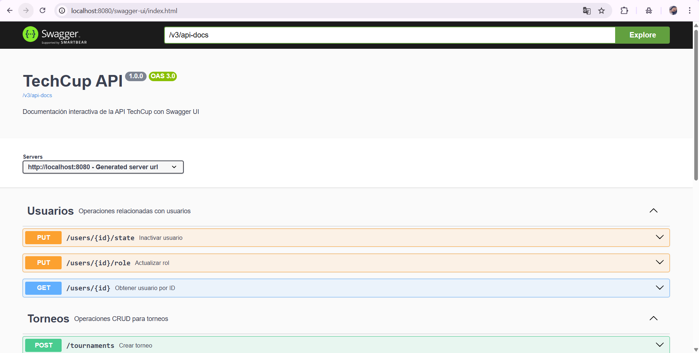
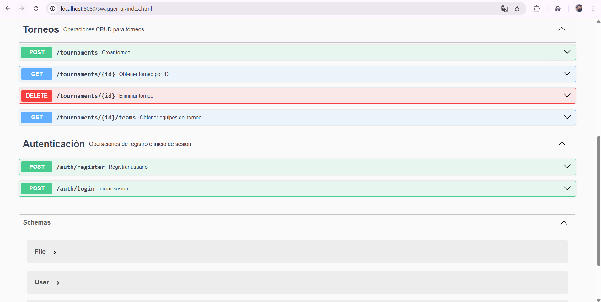
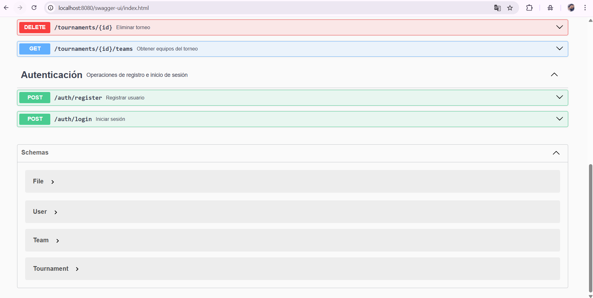
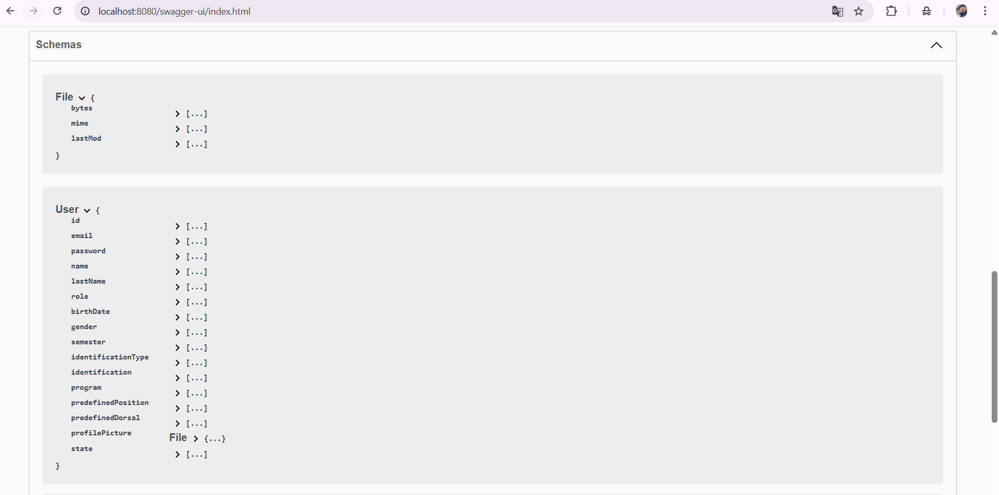
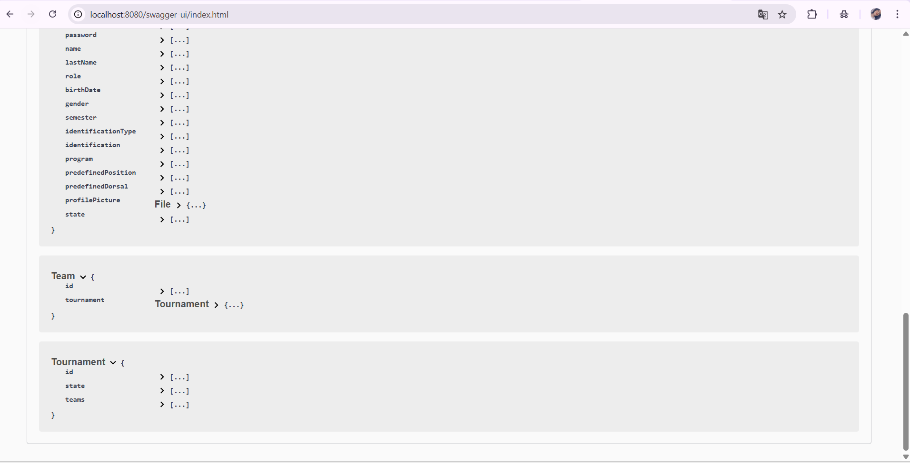
---
## Pruebas funcionamiento
### registrar usuario
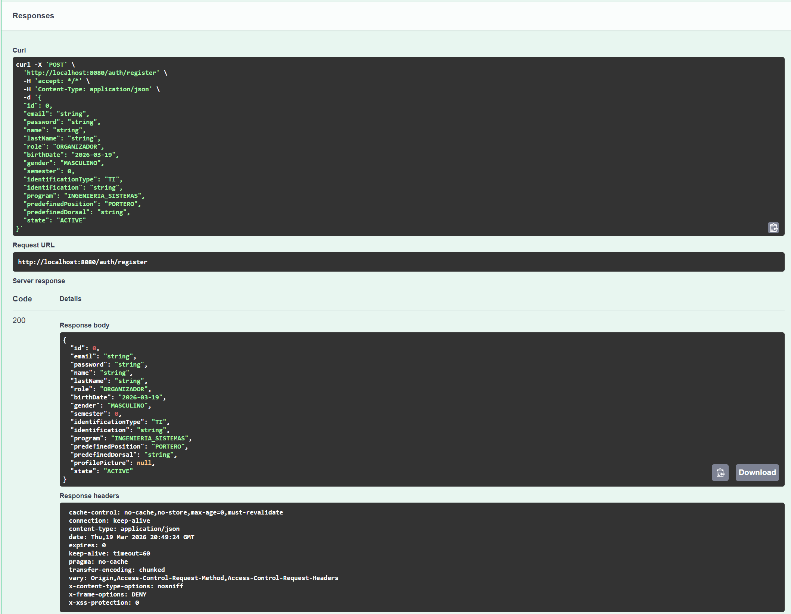
### iniciar sesión
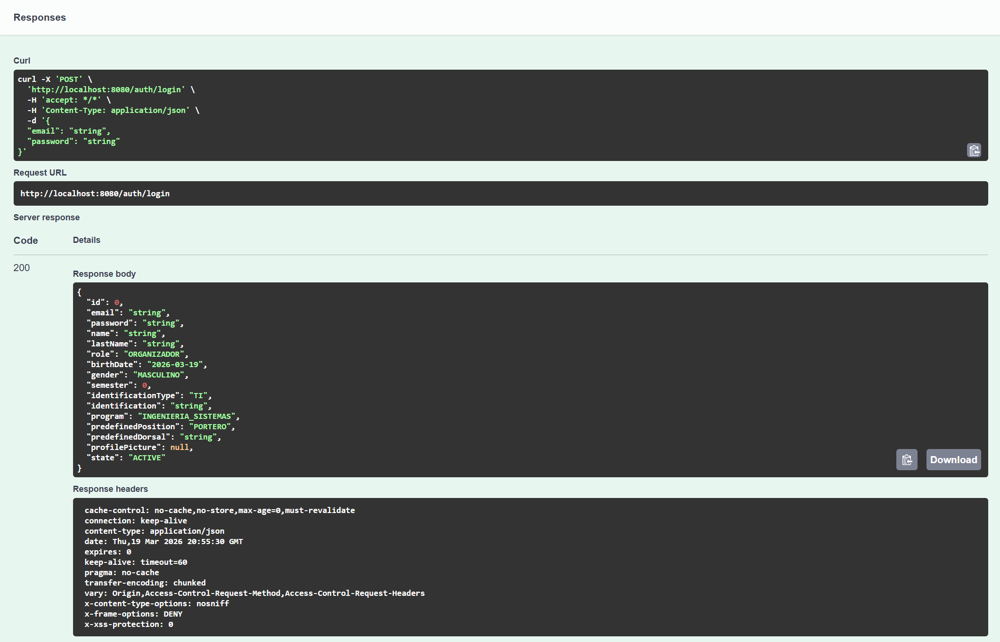
### crear torneo
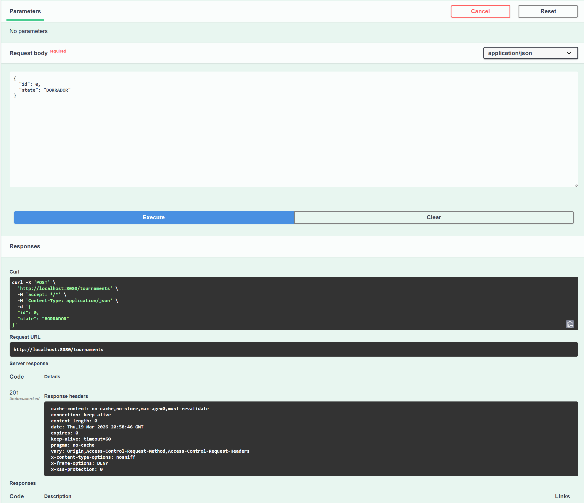
### obtener torneo
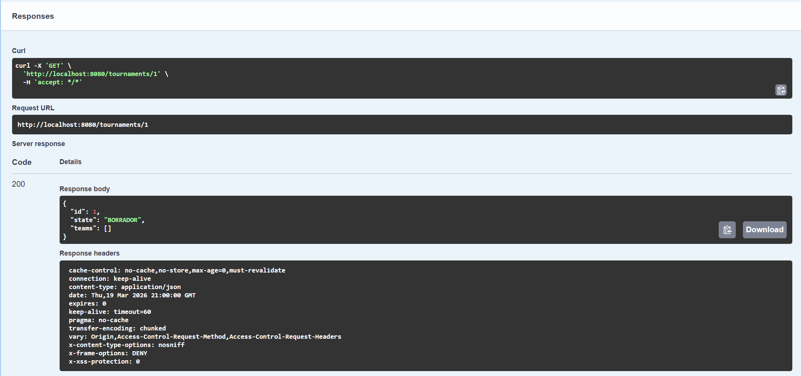
### eliminar torneo
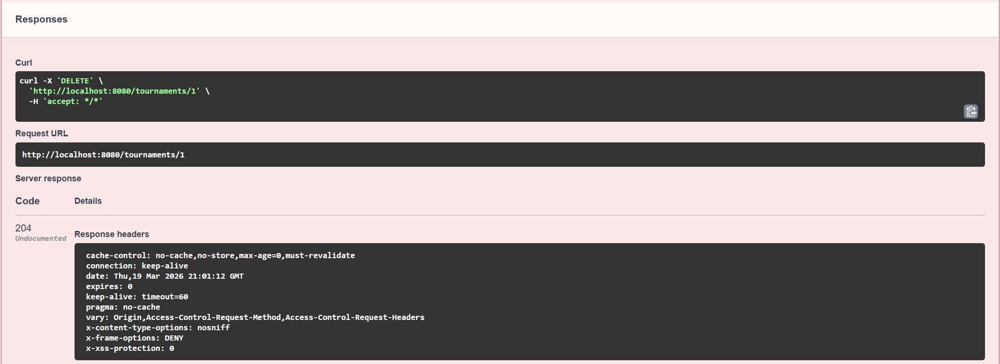

http://localhost:8080/swagger-ui.html
---
## Diagrama de Clases Implementación

Las clases que cumplen con los requerimientos asociados  a la autenticación, usuarios y torneos respectivamente son las siguientes:

### Autenticación

- [AuthenticationController:](src/main/java/edu/eci/dosw/TechCup/controller/AuthenticationController.java) controlador de la autenticacion del usuario por medio de verificación de datos
- [AuthenticationService:](src/main/java/edu/eci/dosw/TechCup/service/AuthenticationService.java) interfaz de autenticación del usuario
- [AuthenticationServiceProd:](src/main/java/edu/eci/dosw/TechCup/service/AuthenticationServiceProd.java) clase encargada de comenzar a generar las conexiones y verificaciones necesarias para verificar la autenticación del usuario en el sistema
- [User:](src/main/java/edu/eci/dosw/TechCup/model/User.java) clase usada para verificar la identidad y correcta relación de los datos ingresados y usados en la autenticación

### Usuarios

- [User:](src/main/java/edu/eci/dosw/TechCup/model/User.java) incluye toda la información relacionada con el usuario a crear y se apoya en enums tales como lo son:
    - [Gender:](src/main/java/edu/eci/dosw/TechCup/model/Gender.java) genero del usuario 
    - [IdentificationType:](src/main/java/edu/eci/dosw/TechCup/model/IdentificationType.java) tipo de identificación del usuario
    - [Position:](src/main/java/edu/eci/dosw/TechCup/model/Position.java) posición del usuario en el torneo
    - [Program:](src/main/java/edu/eci/dosw/TechCup/model/Program.java) programa académico al que pertenece el usuario
    - [Role:](src/main/java/edu/eci/dosw/TechCup/model/Role.java) Tipo de rol que cumple el usuario en la organización
    - [UserState:](src/main/java/edu/eci/dosw/TechCup/model/UserState.java) usuario activo o inactivo en el sistema 
    - [File:](src/main/java/edu/eci/dosw/TechCup/model/File.java) guarda la foto de perfil del usuario

### Torneos

- [Team:](src/main/java/edu/eci/dosw/TechCup/model/Team.java) Guarda los equipos que participarán en cada torneo correspondiente
- [File:](src/main/java/edu/eci/dosw/TechCup/model/File.java) Se encarga de guardar y presentar el manual del torneo
- [Position:](src/main/java/edu/eci/dosw/TechCup/model/Position.java) enum encargado de las posiciones de los jugadores de los torneos
- [Tournament:](src/main/java/edu/eci/dosw/TechCup/model/Tournament.java) Es el encargado principal de guardar toda la información correspondiente a los torneos creados.
- [TournamentRegistration:](src/main/java/edu/eci/dosw/TechCup/model/TournamentRegistration.java) Es el encargado de realizar el registro inicial de los torneos antes de guardarlos como creados
- [TournamentState:](src/main/java/edu/eci/dosw/TechCup/model/TournamentState.java) Define si un torneo ya pasó, esta pendiente o está en curso

**Compilando**

Al compilar el proyecto con los test implementados en la verificación de los requerimientos, obtenemos un buil correcto y funcional donde las pruebas generadas son consistentes con respecto a las clases desarrolladas.

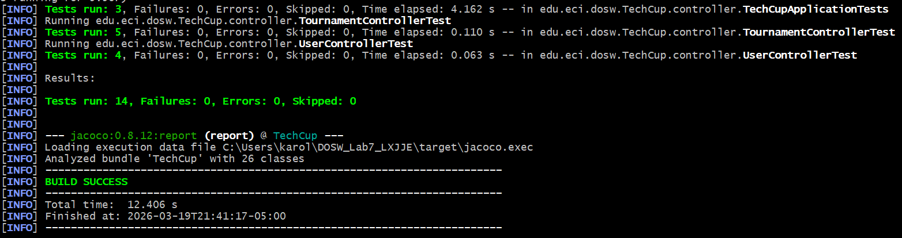

---

## Preguntas 

1. ¿Para qué sirve el paquete Controller en la estructura Spring Boot?
   
    R/ El paquete Controller se encarga de manejar las solicitudes HTTP del cliente. Actúa como intermediario entre el usuario y la lógica del sistema, recibiendo                  peticiones, procesándolas y devolviendo respuestas (generalmente en formato JSON o vistas). Utiliza anotaciones como @RestController o @Controller.

2. ¿Para qué sirve el paquete Service en la estructura Spring Boot?
   
    R/ El paquete Service contiene la lógica de negocio de la aplicación. Aquí se procesan los datos antes de enviarlos al repositorio o devolverlos al controlador. Permite        separar responsabilidades y mantener el código organizado, utilizando anotaciones como @Service.

3. ¿Para qué sirve el paquete Repository en la estructura Spring Boot?
   
    R/ El paquete Repository se encarga del acceso a la base de datos. Permite realizar operaciones CRUD (crear, leer, actualizar y eliminar) sobre las entidades.                  Generalmente extiende interfaces como JpaRepository y usa la anotación @Repository.

4. ¿Para qué sirve el paquete Controller en la estructura Spring Boot?
   
    R/ El paquete Controller cumple la función de recibir y responder solicitudes HTTP, actuando como punto de entrada de la aplicación. Se encarga de dirigir las                  peticiones hacia los servicios correspondientes y devolver la información adecuada al cliente.

5. ¿Para qué sirve el paquete Entity en la estructura Spring Boot?
    
    R/ El paquete Entity define las clases que representan las tablas de la base de datos. Cada entidad está mapeada mediante anotaciones como @Entity, permitiendo la              persistencia de datos a través de JPA o Hibernate.

6. ¿Para qué sirve el paquete DTO en la estructura Spring Boot?
    
    R/El paquete DTO (Data Transfer Object) se utiliza para transferir datos entre capas de la aplicación. Ayuda a evitar exponer directamente las entidades y permite             controlar la información que se envía o recibe en las APIs.

7. ¿Para qué sirve el paquete Exception en la estructura Spring Boot?
   
    R/ El paquete Exception contiene las clases para el manejo de errores personalizados. Permite capturar y gestionar excepciones de forma centralizada, mejorando la              claridad del código y la respuesta al cliente mediante anotaciones como @ControllerAdvice.

## Selección de entidades
Las entidades seleccionadas son:
- User
- Team
- TeamMember
- Tournament
- TournamentRegistration
- TeamInvitation

Las relaciones entre ellas se describen de la siguiente manera:
- TeamMember: (1 -> 1) User, (1..* -> 1) Team.
- TournamentRegistration: (0..* -> 1) Team, (0..* -> 1) Tournament. 
- Tournament: (0..* -> 1) User.
- TeamInvitation: (0..* -> 1)User, (0..* -> 1)TeamMember.

Justificación:

Estas entidades son las necesarias para poder cumplir con el requerimiento principal de crear usuarios, crear equipos y torneos y administrar las inscripciones. Todas tienen una clase en el modelo que se usara para la logica de negocio, pero se necesita que las entidades persistan en la base de datos. 

En cuanto a las relaciones, un TeamMember tiene un solo usuario asociado, y uno o muchos TeamMember están asociados a un equipo, que serian todos sus integrantes, siempre va a haber por lo menos uno que es el capitan del equipo. 

TournamentRegistration es de 0 a muchos con un equipo, porque son todas las veces que un equipo ha participado en un torneo, puede que nunca halla participado en ninguno. Y 0 a muchos con un Tournament por todos los equipos registrados a un torneo, al principio no habra ningun equipo registrado.

Tournament es de 0 a muchos con un usuario que representa el organizador del torneo, ya que un organizador puede crear más de un torneo, o nunca crear ninguno.

TeamInvitation tiene un solo User a la que varias van dirigidas, y de 0 a muchos a TeamMember que representa todas las invitaciones que hace el capitan para invitar jugadores a su equipo.

---
## Database Configuration

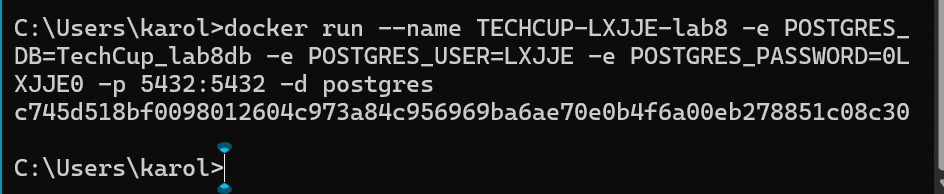

## Database information
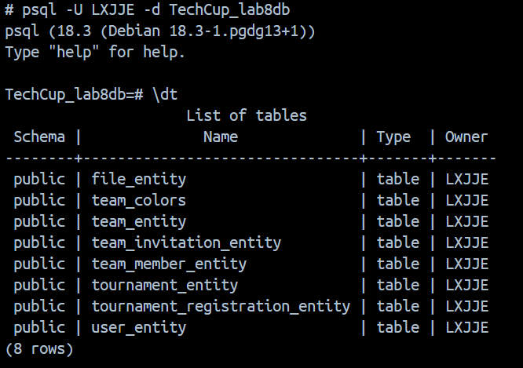

----
## H2 TEST
los test generados para h2 se encuentran guardados en la carpeta [repository](src/test/java/edu/eci/dosw/TechCup/repository/)

Estos mismos subdivididos en test para Team, TeamMember, Tournament y User, cumpliendo con las funciones de guardar, consultar, relacionar entidades y eliminar/actualizar

## Verificar pruebas

Las pruebas funcionan correctamente y se ejecutan desde H2.

### Test Execution
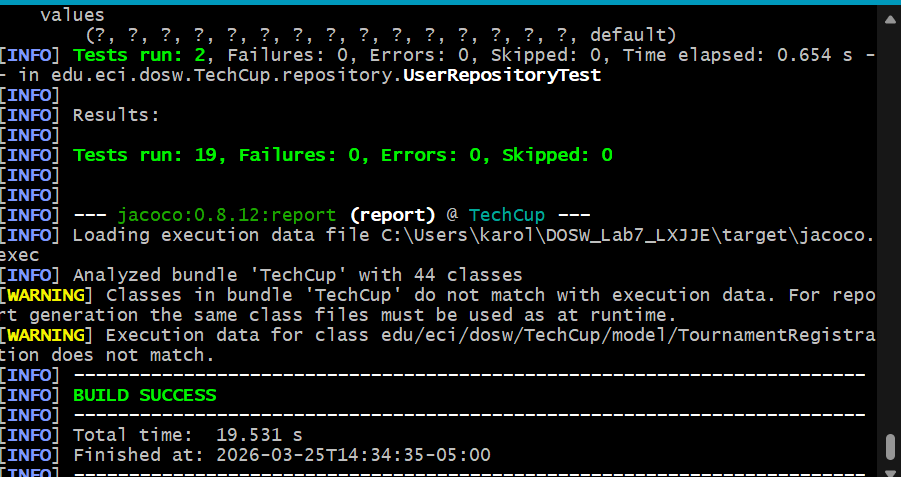

### H2 Confirmation
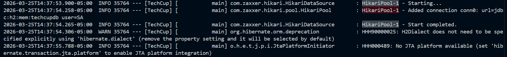

### Postman
Se realizó el GET de usuarios de la Base de datos, obtieniendo como respuesto 200 OK y 
la lista de los usuarios actualmente.
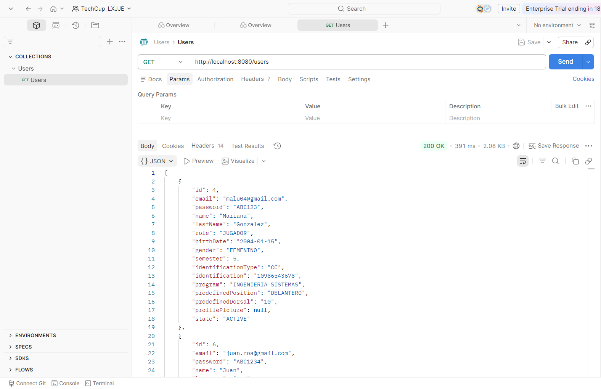


---
## Bibliografía

Pivotal Software. (2023). Spring Boot Reference Documentation. Recuperado de https://spring.io

Baeldung. (2024). Guía de Spring Boot. Recuperado de https://www.baeldung.com

Oracle. (2023). Documentación oficial de Java. Recuperado de https://docs.oracle.com


## Miembros
- Luiza Mariana Gonzales Veloza

- Juan David Roa Hernández

- Juan David Moreno D'Aleman

- Karol Ximena Rodriguez Reyes

- Eduardo Rico Duarte

