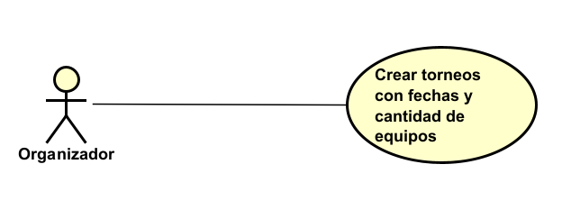

# 📄 Requerimientos del Sistema

## 1. Lista general de requerimientos

El sistema de TECHCUP tiene los siguientes requerimientos:

### 1.1 Requerimientos funcionales

#### Registro de torneo

| Campo | Descripción                                                                                                                                                                                                                                                                                                   |
|------|---------------------------------------------------------------------------------------------------------------------------------------------------------------------------------------------------------------------------------------------------------------------------------------------------------------|
| **ID** | RF-01                                                                                                                                                                                                                                                                                                         |
| **Nombre del requerimiento** | Permitir a los organizadores crear torneos con fechas y cantidad de equipos.                                                                                                                                                                                                                                  |
| **Descripción** | El sistema debe permitir registrar un torneo indicando fecha de inicio, fecha de fin y cantidad de equipos participantes.                                                                                                                                                                                     |
| **Precondiciones** | El actor debe tener rol de Organizador y la base de datos debe estar funcionando.                                                                                                                                                                                                                                          |
| **Actor** | Organizador                                                                                                                                                                                                                                                                                                   |
| **Flujo principal** |1.Si el organizador no tiene una cuenta, debe registrarse y luego iniciar sesion, caso de tener cuenta solo inicia sesion con su correo correspondiente y contraseña.   2.Si no hay torneos creados, el sistema muestra una pantalla con el botón "Crear torneo", de lo contrario muestra los torneos creados en estados activos y finalizado.   3. Al darle clic al botón "Crear torneo", se visualiza el formulario para ingresar los datos pertinentes para su creacion, los cuales son:Nombre del torneo, costo de inscripcción,cantidad de equipos, fecha de inicio y cierre de torneo y cierre de inscripción. Estos datos deben tener las siguientes reglas de negocio: Las fechas de cierre debe ser mayor a la fecha de inicio, la fecha de inicio debe ser mayor a la actual por un día, la fecha de cierre debe ser menor a la fecha de inicio del torneo, el costo no puede ser un numero negativo, y la catidad de equipos debe ser minimo de 2 y maximo 32, el nombre del torneo no debe superar 50 caracteres y el tiempo maximo del torneo es de una semana.   3. Al finalizar el formulario, se dara click en el botón "Crear"   4. Ahora, el sistema muestra el resumen de los datos ingresados y le dara la opccion de confirmar la creación o de devolverse a editar.   5. Al crear el torneo, se reflejara el torneo configurado en una tarjeta con sus fecha inicial y final del torneo, el estado en el que se encuentra, es decir, activo o finalizado y la cantidad de equipos inscritos, a este ultimo, podemos ver sus detalles, en el que el sistema muestra los equipos creados.|
| Colores utilizados | 1. Botó de confirmar o crear: #44E795   2. Botón de retroceder: en el borde #A555EF y de relleno #A555EF  3. Campos donde se ingresa información: borde #44E795 y relleno A555EF.   4. Fondo del formulario: #122040   5. Tarjetas de los equipos: borde #44E795 y relleno #576C89. |
| **Diagrama de caso de uso** |                                                                                                                                                                                                                                                                                                  
| **Poscondiciones** | Torneo registrado con su información básica y estado “Activo” o "Borrador" si no se finaliza el proceso.                                                                                                                                                                                                      |

| Campo | Descripción                                                                                                                                                                                                                        |
|------|------------------------------------------------------------------------------------------------------------------------------------------------------------------------------------------------------------------------------------|
| **ID** | RF-02                                                                                                                                                                                                                              |
| **Nombre del requerimiento** | Permitir a los organizadores iniciar torneos.                                                                                                                                                                                      |
| **Descripción** | El sistema debe permitir cambiar el estado de un torneo a “En Proceso”.                                                                                                                                                            |
| **Precondiciones** | Torneo existente en estado “Activo” y con condiciones mínimas d e inicio cumplidas (p. ej., equipos inscritos según reglamento).                                                                                                    |
| **Actor** | Organizador                                                                                                                                                                                                                        |
| **Flujo principal** | 1. El actor selecciona el torneo. 2. El sistema muestra su detalle y estado actual. 3. El actor solicita iniciar el torneo. 4. El sistema valida condiciones de inicio. 5. El sistema cambia el estado a “En Proceso”. |
| **Diagrama de caso de uso** | *[pendiente]*                                                                                                                                                                                                                      |
| **Poscondiciones** | Torneo en estado “En Proceso”.                                                                                                                                                                                                     |

| Campo | Descripción                                                                                                                                                                                                                                |
|------|--------------------------------------------------------------------------------------------------------------------------------------------------------------------------------------------------------------------------------------------|
| **ID** | RF-03                                                                                                                                                                                                                                      |
| **Nombre del requerimiento** | Permitir a los organizadores finalizar torneos.                                                                                                                                                                                            |
| **Descripción** | El sistema debe permitir cambiar el estado de un torneo a “Finalizado”.                                                                                                                                                                    |
| **Precondiciones** | Torneo existente en estado “En Proceso”.                                                                                                                                                                                                   |
| **Actor** | Organizador                                                                                                                                                                                                                                |
| **Flujo principal** | 1. El actor selecciona el torneo en curso. 2. El sistema muestra el detalle del torneo. 3. El actor solicita finalizar. 4. El sistema valida que no queden partidos pendientes. 5. El sistema cambia el estado a “Finalizado”. |
| **Diagrama de caso de uso** | *[pendiente]*                                                                                                                                                                                                                              |
| **Poscondiciones** | Torneo en estado “Finalizado”.                                                                                                                                                                                                             |

| Campo | Descripción |
|------|-------------|
| **ID** | RF-04 |
| **Nombre del requerimiento** | Permitir a los organizadores consultar la información básica de un torneo. |
| **Descripción** | El sistema debe mostrar información básica del torneo (nombre, fechas, cantidad de equipos, estado). |
| **Precondiciones** | Torneo registrado. Actor autenticado con permisos de lectura. |
| **Actor** | Organizador |
| **Flujo principal** | 1. El actor accede al listado de torneos. 2. El sistema muestra la lista. 3. El actor selecciona un torneo. 4. El sistema muestra la información básica. |
| **Diagrama de caso de uso** | *[pendiente]* |
| **Poscondiciones** | Información consultada sin modificar datos. |

#### Registro de Jugadores

| Campo | Descripción                                                                                                                                                                                                                                                                                                                   |
|------|-------------------------------------------------------------------------------------------------------------------------------------------------------------------------------------------------------------------------------------------------------------------------------------------------------------------------------|
| **ID** | RF-05                                                                                                                                                                                                                                                                                                                         |
| **Nombre del requerimiento** | Permitir a estudiantes, profesores, graduados y personal administrativo registrarse con su correo institucional.                                                                                                                                                                                                              |
| **Descripción** | El sistema debe habilitar el registro de usuarios mediante validación de correo institucional.                                                                                                                                                                                                                                |
| **Precondiciones** | Base de datos para registrar los usuarios.                                                                                                                                                                                                                                                                                    |
| **Actor** | Estudiante / Graduado / Profesor / Personal Administrativo                                                                                                                                                                                                                                                                    |
| **Flujo principal** | 1. El actor accede al registro. 2. El sistema solicita correo institucional, carrera (para estudiantes), nombres, apellidos, género, edad, identificación y contraseña. 3. El actor ingresa la información. 4. El sistema valida dominio y formato. 5. El sistema crea la cuenta y confirma el registro. |
| **Diagrama de caso de uso** | *[pendiente]*                                                                                                                                                                                                                                                                                                                 |
| **Poscondiciones** | Cuenta creada con rol correspondiente.                                                                                                                                                                                                                                                                                        |

| Campo | Descripción                                                                                                                                                                                                                 |
|------|-----------------------------------------------------------------------------------------------------------------------------------------------------------------------------------------------------------------------------|
| **ID** | RF-06                                                                                                                                                                                                                       |
| **Nombre del requerimiento** | Permitir a familiares y arbitros registrarse con correo personal de Gmail.                                                                                                                                                  |
| **Descripción** | El sistema debe permitir el registro de familiares y arbitros validando direcciones de correo Gmail.                                                                                                                        |
| **Precondiciones** | Base de datos para registrar los usuarios.                                                                                                                                                                                  |
| **Actor** | Familiar / Arbitro                                                                                                                                                                                                          |
| **Flujo principal** | 1. El actor accede al registro. 2. El sistema solicita correo Gmail, nombres, apellidos y contraseña. 3. El actor ingresa la información. 4. El sistema valida dominio y formato. 5. El sistema crea la cuenta. |
| **Diagrama de caso de uso** | *[pendiente]*                                                                                                                                                                                                               |
| **Poscondiciones** | Cuenta de familiar / arbitro creada.                                                                                                                                                                                        |

| Campo | Descripción                                                                                                                                                                                                                                |
|------|--------------------------------------------------------------------------------------------------------------------------------------------------------------------------------------------------------------------------------------------|
| **ID** | RF-07                                                                                                                                                                                                                                      |
| **Nombre del requerimiento** | Permitir crear un perfil deportivo con foto de perfil y ubicación preferida.                                                                                                                                                               |
| **Descripción** | El sistema debe permitir a los participantes completar su perfil deportivo con fotografía y ubicación preferida.                                                                                                                           |
| **Precondiciones** | Usuario registrado y autenticado.                                                                                                                                                                                                          |
| **Actor** | Participante                                                                                                                                                                                                                               |
| **Flujo principal** | 1. El actor accede a su perfil deportivo. 2. El sistema muestra el formulario de perfil. 3. El actor carga una foto e ingresa su ubicación preferida. 4. El sistema valida formatos y tamaños. 5. El sistema guarda el perfil. |
| **Diagrama de caso de uso** | *[pendiente]*                                                                                                                                                                                                                              |
| **Poscondiciones** | Perfil deportivo actualizado y disponible para búsquedas e invitaciones.                                                                                                                                                                   |

| Campo | Descripción |
|------|-------------|
| **ID** | RF-08 |
| **Nombre del requerimiento** | Permitir a los participantes administrar su disponibilidad. |
| **Descripción** | El sistema debe permitir a los participantes indicar disponibilidad para entrenamientos y partidos. |
| **Precondiciones** | Usuario registrado con perfil deportivo creado. |
| **Actor** | Participante |
| **Flujo principal** | 1. El actor abre la sección de disponibilidad. 2. El sistema muestra el interfaz de disponibilidad. 3. El actor actualiza su disponibilidad. 4. El sistema guarda los cambios. |
| **Diagrama de caso de uso** | *[pendiente]* |
| **Poscondiciones** | Disponibilidad registrada y visible según permisos. |

| Campo | Descripción |
|------|-------------|
| **ID** | RF-09 |
| **Nombre del requerimiento** | Permitir a los participantes recibir y gestionar invitaciones de equipos. |
| **Descripción** | El sistema debe permitir aceptar o rechazar invitaciones de capitanes para unirse a equipos. |
| **Precondiciones** | Usuario registrado; existencia de invitaciones pendientes. |
| **Actor** | Participante |
| **Flujo principal** | 1. El actor accede a su bandeja de invitaciones. 2. El sistema lista las invitaciones recibidas. 3. El actor acepta o rechaza una invitación. 4. El sistema actualiza el estado de la invitación y la membresía del equipo. |
| **Diagrama de caso de uso** | *[pendiente]* |
| **Poscondiciones** | Invitación resuelta; el equipo refleja la incorporación o mantiene el estado. |

#### Creación y gestión de equipos

| Campo | Descripción                                                                                                                                                                                                                                                                     |
|------|---------------------------------------------------------------------------------------------------------------------------------------------------------------------------------------------------------------------------------------------------------------------------------|
| **ID** | RF-10                                                                                                                                                                                                                                                                           |
| **Nombre del requerimiento** | Permitir a los capitanes crear equipos con nombre, escudo y colores.                                                                                                                                                                                                            |
| **Descripción** | El sistema debe permitir registrar un equipo indicando nombre, escudo y colores oficiales (mínimo 1 máximo 3).                                                                                                                                                                  |
| **Precondiciones** | Usuario con rol de Capitán habilitado.                                                                                                                                                                                                                                          |
| **Actor** | Capitán                                                                                                                                                                                                                                                                         |
| **Flujo principal** | 1. El actor abre la sección de equipos. 2. El sistema muestra el formulario de creación. 3. El actor ingresa nombre y colores, y carga el escudo. 4. El sistema valida unicidad del nombre y formatos. 5. El sistema registra el equipo. |
| **Diagrama de caso de uso** | *[pendiente]*                                                                                                                                                                                                                                                                   |
| **Poscondiciones** | Equipo creado y visible para gestión posterior.                                                                                                                                                                                                                                 |

| Campo | Descripción |
|------|-------------|
| **ID** | RF-11 |
| **Nombre del requerimiento** | Permitir a los capitanes invitar participantes para unirse al equipo. |
| **Descripción** | El sistema debe permitir enviar invitaciones a participantes registrados para integrar el equipo. |
| **Precondiciones** | Equipo creado; participantes existentes en el sistema. |
| **Actor** | Capitán |
| **Flujo principal** | 1. El actor selecciona su equipo. 2. El sistema muestra la gestión de miembros. 3. El actor selecciona participantes y envía invitaciones. 4. El sistema registra invitaciones y notifica a los destinatarios. |
| **Diagrama de caso de uso** | *[pendiente]* |
| **Poscondiciones** | Invitaciones emitidas y en estado “Pendiente”. |

| Campo | Descripción                                                                                                                                                                  |
|------|------------------------------------------------------------------------------------------------------------------------------------------------------------------------------|
| **ID** | RF-12                                                                                                                                                                        |
| **Nombre del requerimiento** | Validar que cada equipo tenga entre 7 y 12 jugadores. ??????????????????????                                                                                                 |
| **Descripción** | El sistema debe aplicar la restricción de mínimo 7 y máximo 12 jugadores por equipo.                                                                                         |
| **Precondiciones** | Equipo en proceso de conformación o inscripción.                                                                                                                             |
| **Actor** | Sistema (regla); Capitán (accionante)                                                                                                                                        |
| **Flujo principal** | 1. El actor intenta confirmar plantilla o inscribir equipo. 2. El sistema verifica la cantidad de jugadores. 3. El sistema permite o rechaza la acción según la regla. |
| **Diagrama de caso de uso** | *[pendiente]*                                                                                                                                                                |
| **Poscondiciones** | Equipos cumplen la restricción de tamaño.                                                                                                                                    |

| Campo | Descripción |
|------|-------------|
| **ID** | RF-13 |
| **Nombre del requerimiento** | Validar que más de la mitad de los jugadores del equipo pertenezcan a Ingeniería de Sistemas, IA, Ciberseguridad o Estadística. |
| **Descripción** | El sistema debe verificar que la mayoría simple de la plantilla pertenezca a los programas autorizados. |
| **Precondiciones** | Jugadores con programa académico registrado. |
| **Actor** | Sistema (regla); Capitán / Organizador |
| **Flujo principal** | 1. El actor intenta confirmar plantilla o inscribir equipo. 2. El sistema calcula proporción de jugadores por programa. 3. El sistema autoriza o rechaza según la regla. |
| **Diagrama de caso de uso** | *[pendiente]* |
| **Poscondiciones** | Plantillas válidas respecto al reglamento. |

| Campo | Descripción                                                                                                                                                        |
|------|--------------------------------------------------------------------------------------------------------------------------------------------------------------------|
| **ID** | RF-14                                                                                                                                                              |
| **Nombre del requerimiento** | Validar que un jugador no pertenezca a dos equipos. ???????????????????                                                                                            |
| **Descripción** | El sistema debe impedir que un mismo jugador esté registrado simultáneamente en más de un equipo del torneo.                                                       |
| **Precondiciones** | Jugadores y equipos registrados.                                                                                                                                   |
| **Actor** | Sistema (regla); Capitán / Organizador                                                                                                                             |
| **Flujo principal** | 1. El actor intenta agregar o confirmar jugador. 2. El sistema consulta pertenencias activas. 3. El sistema rechaza la acción si ya pertenece a otro equipo. |
| **Diagrama de caso de uso** | *[pendiente]*                                                                                                                                                      |
| **Poscondiciones** | Integridad de membresías garantizada.                                                                                                                              |

#### Búsqueda de Jugadores

| Campo | Descripción                                                                                                                                                                                                                                                |
|------|------------------------------------------------------------------------------------------------------------------------------------------------------------------------------------------------------------------------------------------------------------|
| **ID** | RF-15                                                                                                                                                                                                                                                      |
| **Nombre del requerimiento** | Permitir a los capitanes buscar participantes por posición, semester, edad, género, nombre e identificación.                                                                                                                                               |
| **Descripción** | El sistema debe ofrecer filtros de búsqueda para localizar participantes según criterios especificos.                                                                                                                                                      |
| **Precondiciones** | Participantes con perfiles completos.                                                                                                                                                                                                                      |
| **Actor** | Capitán                                                                                                                                                                                                                                                    |
| **Flujo principal** | 1. El actor abre la búsqueda de jugadores. 2. El sistema muestra filtros disponibles. 3. El actor selecciona un filtro e ingresa un texto referente al filtro para iniciar la busqueda. 4. El sistema lista resultados que cumplen los criterios. |
| **Diagrama de caso de uso** | *[pendiente]*                                                                                                                                                                                                                                              |
| **Poscondiciones** | Resultados filtrados visibles para gestión de invitaciones.                                                                                                                                                                                                |

#### Inscripción y pagos

| Campo | Descripción |
|------|-------------|
| **ID** | RF-16 |
| **Nombre del requerimiento** | Permitir a los capitanes registrar el comprobante de pago de la inscripción. |
| **Descripción** | El sistema debe permitir adjuntar y registrar el comprobante de pago asociado al equipo. |
| **Precondiciones** | Equipo creado; ventana de inscripción abierta. |
| **Actor** | Capitán |
| **Flujo principal** | 1. El actor accede a la inscripción del equipo. 2. El sistema solicita adjuntar comprobante y datos requeridos. 3. El actor carga el comprobante. 4. El sistema registra el comprobante en estado “Pendiente”. |
| **Diagrama de caso de uso** | *[pendiente]* |
| **Poscondiciones** | Comprobante registrado y asociado al equipo. |

| Campo | Descripción                                                                                                                                                                                                                                                                                                                                                                                  |
|------|----------------------------------------------------------------------------------------------------------------------------------------------------------------------------------------------------------------------------------------------------------------------------------------------------------------------------------------------------------------------------------------------|
| **ID** | RF-17                                                                                                                                                                                                                                                                                                                                                                                        |
| **Nombre del requerimiento** | Permitir a los organizadores aprobar o rechazar comprobantes de pago.                                                                                                                                                                                                                                                                                                                        |
| **Descripción** | El sistema debe permitir la revisión y resolución de comprobantes de pago.                                                                                                                                                                                                                                                                                                                   |
| **Precondiciones** | Comprobante cargado por el capitán.                                                                                                                                                                                                                                                                                                                                                          |
| **Actor** | Organizador                                                                                                                                                                                                                                                                                                                                                                                  |
| **Flujo principal** | 1. El actor abre el panel de comprobantes. 2. El sistema lista comprobantes pendientes. 3. El actor selecciona un comprobante y este pasa a estado "En revisión". 4. El actor revisa y selecciona aprobar, rechazar o devolverse (sigue en estado "En revisión"). 5. El sistema actualiza el estado del comprobante, del equipo si queda inscrito al torneo. |
| **Diagrama de caso de uso** | *[pendiente]*                                                                                                                                                                                                                                                                                                                                                                                |
| **Poscondiciones** | Comprobante con estado "En revisión", "Aprovado" o "Rechazado" y equipo inscrito a un torneo.                                                                                                                                                                                                                                                                                                |

| Campo | Descripción |
|------|-------------|
| **ID** | RF-18 |
| **Nombre del requerimiento** | Permitir gestionar estados de pago/inscripción de los equipos. |
| **Descripción** | El sistema debe permitir cambiar y consultar estados de inscripción de equipos según el proceso administrativo. |
| **Precondiciones** | Equipo inscrito con comprobante registrado. |
| **Actor** | Organizador |
| **Flujo principal** | 1. El actor accede al equipo. 2. El sistema muestra el estado actual. 3. El actor actualiza el estado según corresponda. 4. El sistema guarda y refleja el nuevo estado. |
| **Diagrama de caso de uso** | *[pendiente]* |
| **Poscondiciones** | Estado de inscripción actualizado y trazable. |

| Campo | Descripción                                                                                                                                                                |
|------|----------------------------------------------------------------------------------------------------------------------------------------------------------------------------|
| **ID** | RF-19                                                                                                                                                                      |
| **Nombre del requerimiento** | Validar que solo equipos con inscripción aprobada puedan participar en el torneo. ???????????????????????????                                                              |
| **Descripción** | El sistema debe restringir la participación a equipos con inscripción en estado “Aprobada”.                                                                                |
| **Precondiciones** | Estados de inscripción definidos.                                                                                                                                          |
| **Actor** | Sistema (regla); Organizador / Capitán                                                                                                                                     |
| **Flujo principal** | 1. Se intenta programar o confirmar participación de un equipo. 2. El sistema verifica el estado de inscripción. 3. El sistema autoriza o bloquea según corresponda. |
| **Diagrama de caso de uso** | *[pendiente]*                                                                                                                                                              |
| **Poscondiciones** | Solo equipos aprobados pueden ser programados o jugar.                                                                                                                     |

#### Configurar Torneo

| Campo | Descripción                                                                                                                                                                                            |
|------|--------------------------------------------------------------------------------------------------------------------------------------------------------------------------------------------------------|
| **ID** | RF-20                                                                                                                                                                                                  |
| **Nombre del requerimiento** | Permitir a los organizadores publicar reglamento y fechas importantes.                                                                                                                                 |
| **Descripción** | El sistema debe permitir cargar y exponer el reglamento y fecha de cierre de inscripciones.                                                                                                            |
| **Precondiciones** | Torneo creado y actor con permisos de edición.                                                                                                                                                         |
| **Actor** | Organizador                                                                                                                                                                                            |
| **Flujo principal** | 1. El actor accede a la configuración del torneo. 2. El sistema muestra opciones de reglamento y fechas. 3. El actor registra o actualiza el contenido. 4. El sistema publica la información. |
| **Diagrama de caso de uso** | *[pendiente]*                                                                                                                                                                                          |
| **Poscondiciones** | Reglamento y fechas visibles para los participantes autorizados.                                                                                                                                       |

| Campo | Descripción |
|------|-------------|
| **ID** | RF-21 |
| **Nombre del requerimiento** | Permitir a los organizadores configurar horarios, canchas y sanciones. |
| **Descripción** | El sistema debe permitir parametrizar horarios, asignación de canchas y catálogo de sanciones. |
| **Precondiciones** | Torneo creado. |
| **Actor** | Organizador |
| **Flujo principal** | 1. El actor abre la configuración avanzada. 2. El sistema muestra las secciones de horarios, canchas y sanciones. 3. El actor registra o ajusta parámetros. 4. El sistema guarda la configuración. |
| **Diagrama de caso de uso** | *[pendiente]* |
| **Poscondiciones** | Parámetros operativos del torneo registrados. |

| Campo | Descripción                                                                                                                                                                                       |
|------|---------------------------------------------------------------------------------------------------------------------------------------------------------------------------------------------------|
| **ID** | RF-22                                                                                                                                                                                             |
| **Nombre del requerimiento** | Permitir a los organizadores configurar el cierre de inscripciones. ??????????????????????????                                                                                                    |
| **Descripción** | El sistema debe permitir definir y actualizar la fecha/hora de cierre de inscripciones.                                                                                                           |
| **Precondiciones** | Torneo en estado “Creado”.                                                                                                                                                                        |
| **Actor** | Organizador                                                                                                                                                                                       |
| **Flujo principal** | 1. El actor accede a configuración de inscripciones. 2. El sistema muestra el campo de cierre. 3. El actor define la fecha/hora de cierre. 4. El sistema guarda y aplica la restricción. |
| **Diagrama de caso de uso** | *[pendiente]*                                                                                                                                                                                     |
| **Poscondiciones** | Cierre de inscripciones establecido y activo.                                                                                                                                                     |

#### Alineaciones del Equipo

| Campo | Descripción                                                                                                                                              |
|------|----------------------------------------------------------------------------------------------------------------------------------------------------------|
| **ID** | RF-23                                                                                                                                                    |
| **Nombre del requerimiento** | Permitir a los capitanes seleccionar titulares, reservas y formación.                                                                                    |
| **Descripción** | El sistema debe permitir definir la lista de titulares, suplentes y formación por partido.                                                               |
| **Precondiciones** | Equipo inscrito; partido programado.                                                                                                                     |
| **Actor** | Capitán                                                                                                                                                  |
| **Flujo principal** | 1. El actor abre la alineación del partido. 2. El actor selecciona titulares y reservas y define la formación. 3. El sistema guarda la alineación. |
| **Diagrama de caso de uso** | *[pendiente]*                                                                                                                                            |
| **Poscondiciones** | Alineación registrada para el partido.                                                                                                                   |

| Campo | Descripción                                                                                                                                                                                                                           |
|------|---------------------------------------------------------------------------------------------------------------------------------------------------------------------------------------------------------------------------------------|
| **ID** | RF-24                                                                                                                                                                                                                                 |
| **Nombre del requerimiento** | Permitir ubicar visualmente a los jugadores en la cancha.                                                                                                                                                                             |
| **Descripción** | El sistema debe permitir disponer a los jugadores en un diagrama de cancha acorde a la formación.                                                                                                                                     |
| **Precondiciones** | Alineación del partido en edición.                                                                                                                                                                                                    |
| **Actor** | Capitán                                                                                                                                                                                                                               |
| **Flujo principal** | 1. El actor abre el editor visual. 2. El sistema muestra la cancha y los jugadores seleccionados. 3. El actor selecciona una posicion y después el jugador a asignar para cada posicion.. 4. El sistema guarda la ubicación. |
| **Diagrama de caso de uso** | *[pendiente]*                                                                                                                                                                                                                         |
| **Poscondiciones** | Disposición táctica almacenada.                                                                                                                                                                                                       |

| Campo | Descripción |
|------|-------------|
| **ID** | RF-25 |
| **Nombre del requerimiento** | Permitir a los participantes consultar la alineación del equipo rival. |
| **Descripción** | El sistema debe permitir visualizar la alineación del equipo contrario cuando esté disponible. |
| **Precondiciones** | Alineación del rival publicada/visible para el partido correspondiente. |
| **Actor** | Participante |
| **Flujo principal** | 1. El actor selecciona el partido en el calendario. 2. El sistema muestra la información del encuentro. 3. El actor abre la alineación rival. 4. El sistema presenta la alineación registrada. |
| **Diagrama de caso de uso** | *[pendiente]* |
| **Poscondiciones** | Alineación rival consultada sin cambios. |

| Campo | Descripción |
|------|-------------|
| **ID** | RF-26 |
| **Nombre del requerimiento** | Validar que participen únicamente 7 jugadores por partido. |
| **Descripción** | El sistema debe asegurar que la alineación titular cumpla con 7 jugadores activos por partido. |
| **Precondiciones** | Alineación en edición. |
| **Actor** | Sistema (regla); Capitán |
| **Flujo principal** | 1. El actor intenta guardar la alineación. 2. El sistema cuenta jugadores titulares. 3. El sistema acepta o rechaza la alineación según la regla. |
| **Diagrama de caso de uso** | *[pendiente]* |
| **Poscondiciones** | Alineaciones válidas en cantidad de jugadores. |

#### Registro de Partidos

| Campo | Descripción                                                                                                                                                                                       |
|------|---------------------------------------------------------------------------------------------------------------------------------------------------------------------------------------------------|
| **ID** | RF-27                                                                                                                                                                                             |
| **Nombre del requerimiento** | Permitir a los organizadores registrar resultados de partido (marcador, goleadores, tarjetas amarillas y rojas).                                                                                  |
| **Descripción** | El sistema debe permitir registrar el resultado y los eventos disciplinarios por partido.                                                                                                         |
| **Precondiciones** | Partido finalizado.                                                                                                                                                                               |
| **Actor** | Organizador                                                                                                                                                                                       |
| **Flujo principal** | 1. El actor accede al partido finalizado. 2. El sistema muestra el formulario de resultados. 3. El actor ingresa marcador y eventos (goles, tarjetas). 4. El sistema guarda el registro. |
| **Diagrama de caso de uso** | *[pendiente]*                                                                                                                                                                                     |
| **Poscondiciones** | Resultado y eventos almacenados para estadísticas y tabla.                                                                                                                                        |

#### Consulta de Partidos

| Campo | Descripción |
|------|-------------|
| **ID** | RF-28 |
| **Nombre del requerimiento** | Permitir a los árbitros consultar fecha, hora, cancha y equipos del partido asignado. |
| **Descripción** | El sistema debe permitir al árbitro ver los datos logísticos del partido asignado. |
| **Precondiciones** | Árbitro asignado a un partido. |
| **Actor** | Árbitro |
| **Flujo principal** | 1. El actor abre su agenda de partidos. 2. El sistema lista los partidos asignados. 3. El actor selecciona un partido. 4. El sistema muestra fecha, hora, cancha y equipos. |
| **Diagrama de caso de uso** | *[pendiente]* |
| **Poscondiciones** | Información consultada sin modificar datos. |

#### Tabla de Posiciones

| Campo | Descripción |
|------|-------------|
| **ID** | RF-29 |
| **Nombre del requerimiento** | Calcular automáticamente por equipo: partidos jugados, ganados, empatados, perdidos, goles a favor, goles en contra, diferencia de gol y puntos. |
| **Descripción** | El sistema debe actualizar automáticamente las métricas de tabla por equipo a partir de los resultados registrados. |
| **Precondiciones** | Resultados de partidos registrados. |
| **Actor** | Sistema |
| **Flujo principal** | 1. Se registra o actualiza un resultado. 2. El sistema recalcula estadísticas del equipo. 3. El sistema actualiza la tabla de posiciones. |
| **Diagrama de caso de uso** | *[pendiente]* |
| **Poscondiciones** | Tabla de posiciones consistente con los resultados. |

| Campo | Descripción                                                                                                                                                                |
|------|----------------------------------------------------------------------------------------------------------------------------------------------------------------------------|
| **ID** | RF-30                                                                                                                                                                      |
| **Nombre del requerimiento** | Permitir consultar la tabla de posiciones actualizada.                                                                                                                     |
| **Descripción** | El sistema debe permitir visualizar la tabla de posiciones vigente del torneo.                                                                                             |
| **Precondiciones** | Cálculo de estadísticas disponible.                                                                                                                                        |
| **Actor** | Usuario                                                                                                                                                                    |
| **Flujo principal** | 1. El actor accede a la sección de tabla de posiciones de un torneo. 2. El sistema muestra la tabla actualizada. |
| **Diagrama de caso de uso** | *[pendiente]*                                                                                                                                                              |
| **Poscondiciones** | Tabla consultada sin impacto en cálculos.                                                                                                                                  |

#### Llaves Eliminatorias

| Campo | Descripción                                                                                                                             |
|------|-----------------------------------------------------------------------------------------------------------------------------------------|
| **ID** | RF-31                                                                                                                                   |
| **Nombre del requerimiento** | Generar automáticamente cruces iniciales para la fase eliminatoria.                                                                     |
| **Descripción** | El sistema debe generar los enfrentamientos iniciales de la fase eliminatoria según el reglamento del torneo.                           |
| **Precondiciones** | Fase regular finalizada; equipos clasificados determinados.                                                                             |
| **Actor** | Sistema / Organizador (disparador)                                                                                                      |
| **Flujo principal** | 1. El actor inicia el torneo. 2. El sistema identifica equipos clasificados. 3. El sistema genera y registra los cruces iniciales. |
| **Diagrama de caso de uso** | *[pendiente]*                                                                                                                           |
| **Poscondiciones** | Llaves iniciales creadas y visibles para programación.                                                                                  |

| Campo | Descripción |
|------|-------------|
| **ID** | RF-32 |
| **Nombre del requerimiento** | Generar automáticamente cuartos de final, semifinal y final. |
| **Descripción** | El sistema debe generar las siguientes fases eliminatorias en función de los resultados de las fases anteriores. |
| **Precondiciones** | Cruces de la fase previa resueltos. |
| **Actor** | Sistema |
| **Flujo principal** | 1. Se registran resultados de la fase vigente. 2. El sistema determina equipos clasificados. 3. El sistema crea la fase siguiente hasta la final. |
| **Diagrama de caso de uso** | *[pendiente]* |
| **Poscondiciones** | Llaves de fases subsiguientes generadas. |

####  Estadísticas

| Campo | Descripción                                                                                                                                                |
|------|------------------------------------------------------------------------------------------------------------------------------------------------------------|
| **ID** | RF-33                                                                                                                                                      |
| **Nombre del requerimiento** | Permitir consultar máximos goleadores.                                                                                                                     |
| **Descripción** | El sistema debe permitir visualizar el ranking de goleadores del torneo.                                                                                   |
| **Precondiciones** | Goles registrados en resultados de partidos.                                                                                                               |
| **Actor** | Usuario                                                                                                                                                    |
| **Flujo principal** | 1. El actor accede a la sección de estadísticas de un torneo específico. 2. El sistema muestra el listado de goleadores ordenado por cantidad de goles. |
| **Diagrama de caso de uso** | *[pendiente]*                                                                                                                                              |
| **Poscondiciones** | Estadística consultada sin modificar datos.                                                                                                                |

| Campo | Descripción |
|------|-------------|
| **ID** | RF-34 |
| **Nombre del requerimiento** | Permitir consultar historial de partidos y resultados por equipo. |
| **Descripción** | El sistema debe permitir visualizar los partidos jugados por un equipo y sus resultados. |
| **Precondiciones** | Resultados registrados. |
| **Actor** | Usuario |
| **Flujo principal** | 1. El actor selecciona un equipo. 2. El sistema muestra su historial de partidos. 3. El actor navega por los detalles de cada encuentro. |
| **Diagrama de caso de uso** | *[pendiente]* |
| **Poscondiciones** | Historial consultado sin cambios en datos. |

| Campo | Descripción |
|------|-------------|
| **ID** | RF-35 |
| **Nombre del requerimiento** | Permitir consultar las fases de cuartos de final, semifinal y final. |
| **Descripción** | El sistema debe permitir visualizar el avance y los emparejamientos de las fases eliminatorias. |
| **Precondiciones** | Llaves eliminatorias generadas. |
| **Actor** | Usuario |
| **Flujo principal** | 1. El actor accede al módulo de llaves. 2. El sistema muestra el llaves con rondas activas. 3. El actor consulta emparejamientos y resultados. |
| **Diagrama de caso de uso** | *[pendiente]* |
| **Poscondiciones** | Llaves consultadas. |

#### Seguridad

| Campo | Descripción                                                                                                                                                                                                    |
|------|----------------------------------------------------------------------------------------------------------------------------------------------------------------------------------------------------------------|
| **ID** | RF-36                                                                                                                                                                                                          |
| **Nombre del requerimiento** | Registrar un log de acciones para auditoría.                                                                                                                                                                   |
| **Descripción** | El sistema debe registrar eventos relevantes de user y sistema para trazabilidad y auditoría.                                                                                                               |
| **Precondiciones** | Módulo de logging habilitado.                                                                                                                                                                                  |
| **Actor** | Sistema                                                                                                                                                                                                        |
| **Flujo principal** | 1. Se ejecuta una acción relevante (creación, actualización, acceso, cambio de estado, etc.). 2. El sistema registra el evento con metadatos (user, fecha/hora, entidad, acción) en un archivo de texto. |
| **Diagrama de caso de uso** | *[pendiente]*                                                                                                                                                                                                  |
| **Poscondiciones** | Eventos almacenados y disponibles para consulta de auditoría.                                                                                                                                                  |

### 1.2 Requerimientos no funcionales:
- Control de roles y permisos.
- Registro de acciones.
- Backend en Spring Boot separado por capas de controladores, adaptadores, lógica y datos.
- Manejo de API REST con Spring Boot.
- Frontend en React (aplicación web) con Typescript.
- Base de datos en PostgreSQL.

## Mockup inical
https://marvelapp.com/prototype/g7e74j8/screen/98533333

Contraseña: DOSW
